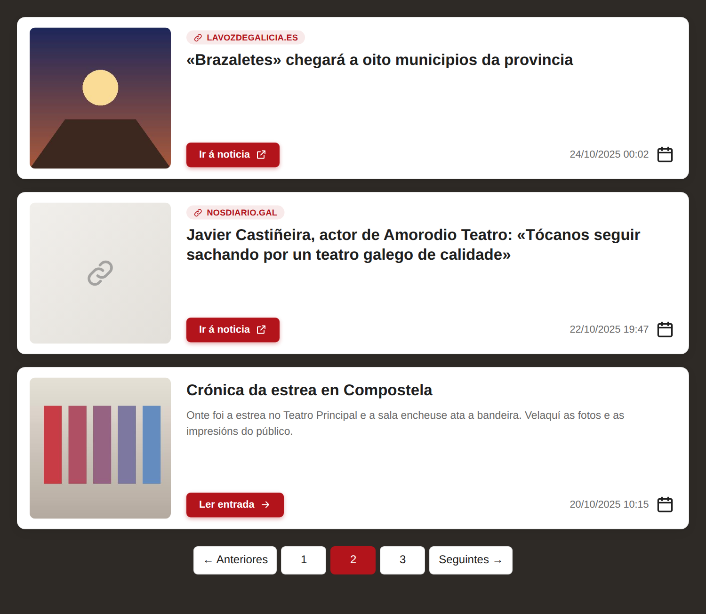

<div align="center">

<h1>
    <table border="0">
    <tr border="0">
        <td align="center" valign="middle" border="0">
        <picture>
            <source media="(prefers-color-scheme: dark)" srcset="https://cdn.simpleicons.org/wordpress/white">
            
        </picture>
        </td>
        <td valign="middle" border="0">
        <strong>Wordpress</strong><br>
        Show Links as Posts
        </td>
    </tr>
    </table>
</h1>

**Plugin de WordPress para publicar ligazóns externas como se fosen entradas do blog.**




</div>

## Por que

Cando un xornal fala da túa web ou do teu traballo, o normal é querer que esa noticia apareza no blog, na mesma lista ca o resto de entradas. Pero escribir unha entrada enteira só para poñer «lede a noticia aquí» non ten sentido. Este plugin crea **entradas-ligazón**: teñen título, data, imaxe destacada e unha URL, e ao premelas levan directamente á noticia orixinal.

## Funcionalidades

- Engade un botón **Engadir ligazón** ao lado de «Engadir entrada» na lista de entradas (e submenú *Entradas → Engadir ligazón*).
- Formulario sinxelo: título, ligazón, data e hora, imaxe destacada, categorías e estado.
- Imaxe destacada da **mediateca** de WordPress ou desde unha **URL externa**.
- Opción de abrir a ligazón nunha **nova lapela**.
- As ligazóns son entradas normais (formato *Ligazón*): saen na portada, arquivos, categorías, bloques e RSS de calquera tema sen tocar nada.
- O permalink da entrada é a URL externa; se alguén chega á URL interna, redirixe á noticia.
- Na lista do escritorio: etiqueta **— Ligazón**, vista **Ligazóns (n)** para filtralas e «Editar» abre o formulario propio en vez do editor de bloques.
- **Importar / Exportar ligazóns** en CSV dende *Ferramentas*: importa descargando as imaxes á mediateca e sen duplicar as que xa existen, e exporta todas as ligazóns no mesmo formato.
- Shortcode `[posts-wp-show-links-as-posts]` cunha lista en tarxetas de entradas e ligazóns mesturadas, con paxinación e filtros.
- As ligazóns non se inclúen no sitemap de WordPress.

## Configuración

### Requisitos

| | |
|---|---|
| WordPress | 5.9 ou superior |
| PHP | 7.4 ou superior |
| Base de datos | A de calquera instalación estándar (non crea táboas propias) |

### Instalación: Opción A — Subir un ZIP dende o escritorio

1. Comprime a carpeta do plugin nun ficheiro `.zip`.
2. No escritorio de WordPress: **Plugins → Engadir novo → Subir complemento**.
3. Escolle o ZIP, preme **Instalar agora** e despois **Activar**.

### Instalación: Opción B — FTP ou xestor de ficheiros do aloxamento

1. Sube a carpeta completa a `wp-content/plugins/wp-show-links-as-posts/`.
2. No escritorio: **Plugins** e activa **Wordpress Show Links as Posts**.

O plugin non crea táboas: garda os datos de cada ligazón como metadatos da propia entrada.

| Meta | Contido |
|---|---|
| `_wpslap_url` | URL externa (é o que marca unha entrada como ligazón) |
| `_wpslap_image_url` | URL da imaxe destacada externa (se non se usa a mediateca) |
| `_wpslap_new_tab` | `1` se se abre nunha nova lapela |

## Uso

### 1. Engadir unha ligazón

En **Entradas** preme **Engadir ligazón** (ao lado de «Engadir entrada») e enche o formulario:

| Campo | Para que serve |
|---|---|
| Título | O título que se amosa na lista, por exemplo o titular da noticia. |
| Ligazón | URL á que leva a entrada (`http` ou `https`). |
| Abrir nunha nova lapela | Marcado por defecto. |
| Data e hora | Data coa que se ordena na lista. Se é futura, a ligazón queda programada. |
| Imaxe destacada | **Sen imaxe**, **Da mediateca** ou **Desde unha URL**, con vista previa. |
| Categorías | As mesmas categorías ca as entradas normais. |
| Estado | Publicada, pendente de revisión, borrador ou privada. |

> Os usuarios sen permiso para publicar (colaboradores) gardan as ligazóns como **pendentes de revisión**.

### 2. Xestionar as ligazóns

As ligazóns aparecen na lista de **Entradas** mesturadas coas demais:

- Levan a etiqueta **— Ligazón** ao lado do título.
- Enriba da lista hai unha vista **Ligazóns (n)** para ver só as ligazóns.
- Premer no título ou en **Editar** abre o formulario de ligazón. **Edición rápida**, **Ver** e **Papeleira** funcionan como sempre (**Ver** abre a noticia externa).

### 3. Como se ven na web

Sen facer nada, o tema amosa as ligazóns como calquera outra entrada. O título e a imaxe levan directamente á URL externa, e funcionan as funcións estándar (`the_permalink()`, `has_post_thumbnail()`, `the_post_thumbnail()`, `get_the_post_thumbnail_url()`) e os bloques *Título da entrada* e *Imaxe destacada*.

### 4. Amosar a lista co shortcode

O shortcode é:

```
[posts-wp-show-links-as-posts]
```

| Onde | Como |
|---|---|
| Editor de bloques | Bloque **Shortcode** con `[posts-wp-show-links-as-posts]` |
| Widgets | Bloque de texto ou HTML co shortcode |
| Tema clásico | `<?php echo do_shortcode('[posts-wp-show-links-as-posts]'); ?>` no modelo que queiras |
| Elementor e outros construtores | Widget **Shortcode** co mesmo texto |

Amosa entradas normais e ligazóns mesturadas por orde de data, en tarxetas con imaxe, medio de orixe (só nas ligazóns), título, botón e data. En móbil a imaxe pasa a ir enriba.

Atributos opcionais:

| Atributo | Valores | Por defecto |
|---|---|---|
| `cantidade` | entradas por páxina (máx. 100) | `10` |
| `tipo` | `todas`, `ligazons`, `entradas` | `todas` |
| `categoria` | slug(s) de categoría separados por comas | — |
| `paxinacion` | `si`, `non` | `si` |
| `extracto` | `si`, `non`: extracto das entradas normais | `non` |
| `dominio` | `si`, `non`: etiqueta co medio da ligazón | `si` |
| `formato_data` | formato de data de PHP | `d/m/Y H:i` |
| `texto_ligazon` | texto do botón das ligazóns | «Ir á noticia» |
| `texto_entrada` | texto do botón das entradas normais | «Ler entrada» |
| `cor` | cor de acento en hexadecimal | `#b3141b` |

```
[posts-wp-show-links-as-posts cantidade="5"]
[posts-wp-show-links-as-posts tipo="ligazons" categoria="prensa"]
[posts-wp-show-links-as-posts extracto="si" paxinacion="non"]
[posts-wp-show-links-as-posts cor="#1f5fa8" texto_ligazon="Ler no xornal"]
```

A paxinación usa o parámetro `wpslap_paxina` na URL, así que non choca coa paxinación do tema.

### 5. Importar / Exportar ligazóns

En **Ferramentas → Importar / Exportar ligazóns** (xusto debaixo de *Importar* e *Exportar* de WordPress) podes crear moitas ligazóns dunha vez ou descargalas todas.

#### Importar

 O CSV leva unha fila por ligazón e unha cabeceira con estas columnas (en calquera orde):

```
data,hora,titulo,ligazon,imaxe,categorias
24/10/2025,00:02,«Brazaletes» chegará a oito municipios da provincia,https://www.lavozdegalicia.es/…,https://…/imaxe.png,Prensa
```

| Columna | Contido |
|---|---|
| `data` | `dd/mm/aaaa` ou `aaaa-mm-dd`. Se está baleira, úsase a data actual. |
| `hora` | `hh:mm` (tamén vale `hh.mm`). Opcional. |
| `titulo` | Obrigatorio. |
| `ligazon` | Obrigatorio (`http` ou `https`). |
| `imaxe` | URL da imaxe destacada. Opcional. |
| `categorias` | Nomes separados por comas. Opcional: as que non existen créanse; se está baleira úsase a categoría por defecto da importación. |

Tamén recoñece os nomes en inglés e castelán (`date`, `time`, `title`, `link` / `url`, `image`…). Serve separado por comas ou por punto e coma (o CSV que garda Excel), en UTF-8 ou en Windows-1252.

Opcións da importación:

| Opción | Que fai |
|---|---|
| Imaxes | **Descargalas á mediateca** (recomendado), **usar a URL externa** ou **non importalas**. Se unha imaxe non se pode descargar, úsase a súa URL. As imaxes repetidas só se descargan unha vez. |
| Categoría por defecto | Categoría para as filas que non traen `categorias`. |
| Estado | Publicadas ou borrador. |
| Nova lapela | Se as ligazóns se abren nunha nova lapela. |

Ao rematar amósase unha táboa co resultado de cada fila (creada, omitida ou erro).

> As ligazóns cuxa URL xa existe na web omítense, así que importar dúas veces o mesmo ficheiro non duplica nada.

#### Exportar

O botón **Descargar CSV** descarga todas as ligazóns publicadas (ou tamén os borradores, pendentes, privadas e programadas, se marcas a opción) nun CSV co mesmo formato que acepta o importador. Serve como copia de seguridade ou para levar as ligazóns a outra web: a imaxe exportada é a URL da mediateca ou a externa.

### Personalización (CSS)

O aspecto da lista sae de variables CSS definidas en `assets/shortcode.css`. Podes sobrescribilas no CSS do teu tema sen tocar o plugin:

```css
.wpslap-wrap {
  --wpslap-accent: #b3141b;          /* botón, etiqueta do medio, paxinación */
  --wpslap-bg: #fff;                 /* fondo das tarxetas */
  --wpslap-text: #1f1f1f;            /* título e icona do calendario */
  --wpslap-muted: #6b6b6b;           /* data e extracto */
  --wpslap-radius: 12px;             /* bordos redondeados */
  --wpslap-media: 200px;             /* ancho da imaxe */
}
```

Cada tarxeta ten as clases `.wpslap-card` e `.wpslap-card--link` ou `.wpslap-card--post`. Nas listas do tema, as ligazóns levan a clase `.wpslap-link` (e `.format-link`) para darlles un estilo propio.

## Preguntas frecuentes

**Non vexo o botón «Engadir ligazón».**
Só aparece na lista de **Entradas** e para usuarios que poden editar entradas. Tamén está no menú *Entradas → Engadir ligazón*.

**Ao premer «Editar» nunha ligazón non se abre o editor de bloques.**
É intencionado: as ligazóns non teñen contido, así que se editan no seu propio formulario.

**A imaxe desde URL non se ve no meu tema.**
Algúns temas pintan a imaxe destacada a partir do ID do adxunto (`wp_get_attachment_image()`) en vez de coas funcións de miniatura. Nese caso usa unha imaxe da mediateca.

**Que pasa se desactivo o plugin?**
Non se borra nada. As ligazóns quedan como entradas normais sen contido e volven levar á súa propia URL. Ao reactivalo volven funcionar como ligazóns.

**Ao importar, as imaxes quedan «desde URL» en vez de na mediateca.**
O servidor non puido descargalas (é habitual en instalacións locais como MAMP ou XAMPP se PHP non ten certificados SSL). As ligazóns créanse igual coa URL externa; se máis adiante queres a imaxe na mediateca, edita a ligazón e escóllea.

**Quero que a ligazón abra na mesma lapela.**
Desmarca **Abrir nunha nova lapela** no formulario desa ligazón.

## Estrutura do proxecto

```
wp-show-links-as-posts/
├── wp-show-links-as-posts.php      # Cabeceira do plugin, constantes e funcións auxiliares
├── includes/
│   ├── class-wpslap-admin.php      # Botón, formulario, gardado e integración coa lista de entradas
│   ├── class-wpslap-frontend.php   # Permalink externo, imaxe por URL, redirección e nova lapela
│   ├── class-wpslap-shortcode.php  # Shortcode [posts-wp-show-links-as-posts] e HTML das tarxetas
│   └── class-wpslap-importer.php   # Importación e exportación de ligazóns en CSV
└── assets/
    ├── admin-list.js               # Inserta o botón «Engadir ligazón»
    ├── admin-form.js               # Selector da mediateca e vistas previas
    ├── admin-form.css              # Estilos do formulario
    ├── shortcode.css               # Estilos das tarxetas e variables de personalización
    └── img/                        # Capturas de mostra
```

## Historial de versións

| Versión | Cambios |
|---|---|
| 1.0.0 | Versión inicial. |

## Licenza

GPL-2.0-or-later. Consulta o texto da licenza en [gnu.org](https://www.gnu.org/licenses/old-licenses/gpl-2.0.html).

## Autor

[Ismael Castiñeira](https://ipardelo.es)

```bash
VIVA GHALISIA E A COSTA DA MORTE! 💀
```